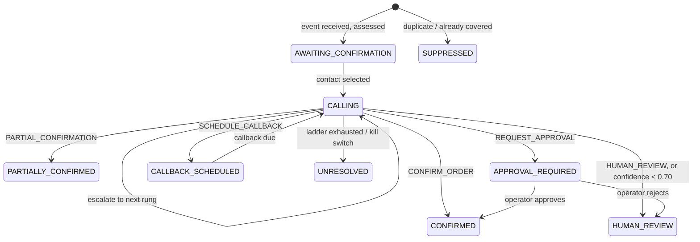
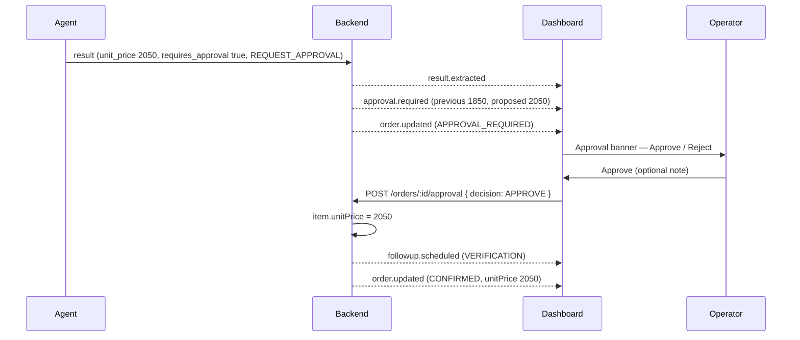
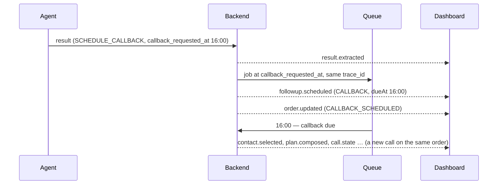
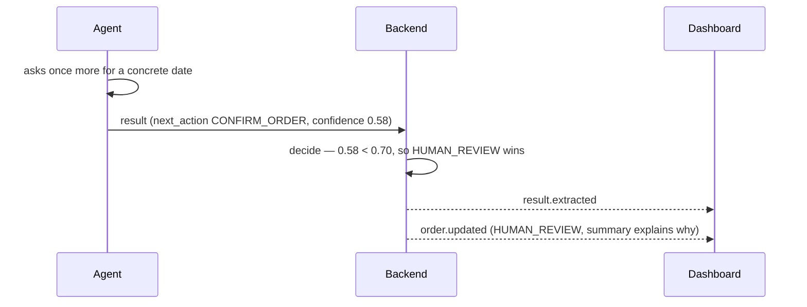
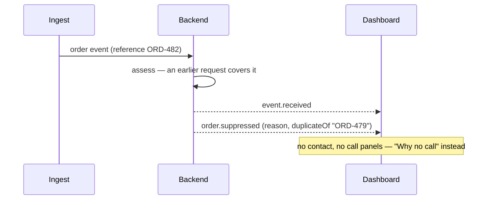

# Frontend ↔ Backend Contract — Wholesale Coordination

**Status:** Proposed · **Version:** 2.0 (wholesale pivot, PRD v2.0) · **Date:** 13 Sep 2026
**Owners:** Sameer (backend, REST, SSE) · Aryan (agent events) · Vishal (dashboard) — per PRD §14.1
**Implemented by:** the dashboard's mock driver, [`apps/web/src/app/api/v1/`](../apps/web/src/app/api/v1)
**Types:** [`apps/web/src/lib/contracts/`](../apps/web/src/lib/contracts) — to move into `packages/types` when its owners migrate it

This is everything the dashboard needs from the backend: the data it reads, the endpoints it calls, the live events it listens for, and the operator actions it sends back. The dashboard already runs end to end against a mock that implements exactly this. A backend that implements it replaces the mock with **one environment variable** and no dashboard changes.

---

## Contents

0. [Checklist for the backend](#0-checklist-for-the-backend)
1. [Entities](#1-entities)
2. [Order lifecycle](#2-order-lifecycle)
3. [REST endpoints](#3-rest-endpoints)
4. [SSE events](#4-sse-events)
5. [The extras, flow by flow](#5-the-extras-flow-by-flow)
6. [Rules the backend owns](#6-rules-the-backend-owns)
7. [Switching the dashboard to the backend](#7-switching-the-dashboard-to-the-backend)
8. [Gaps and open questions](#8-gaps-and-open-questions)

---

## 0. Checklist for the backend

- [ ] **7 REST endpoints** plus the simulator and kill switch — [§3](#3-rest-endpoints)
- [ ] **One SSE stream per order**, replaying past events on connect — [§4.1](#41-the-stream)
- [ ] **13 event types**, validated by the dashboard with Zod — [§4.3](#43-event-catalogue)
- [ ] **The `next_action` → status mapping**, with the confidence rule applied first — [§2.2](#22-from-a-call-result-to-an-order-status)
- [ ] **Three operator actions:** approve or reject a price, correct a field, kill switch — [§3](#3-rest-endpoints)
- [ ] **Follow-ups** as first-class records with a due time — [§5.4](#54-follow-ups)
- [ ] **Duplicate suppression** before any call is planned — [§5.5](#55-duplicate-order--suppressed)
- [ ] `trace_id` on every order, event, call and follow-up (CLAUDE.md Rule 7)

---

## 1. Entities

All timestamps are ISO-8601 UTC strings. The dashboard formats them in facility time (`Asia/Kolkata`).

### Organization

| Field | Type | Notes |
|---|---|---|
| `id` | string | `org-northgate` |
| `name` | string | `Northgate Distributors` |
| `role` | `"WHOLESALER" \| "DISTRIBUTOR"` | |

### Contact

A consented business contact. **Only these numbers are ever called** (FR-7.2).

| Field | Type | Notes |
|---|---|---|
| `id` | string | |
| `organizationId` | string | The company they work for |
| `name`, `role` | string | `Rajesh Iyer`, `Dispatch Lead` |
| `phoneE164` | string | The dashboard always displays it masked |
| `productCategories` | string[] | Used for contact selection (FR-3.2) |
| `region` | string | |
| `workingHours` | `{ start, end, timezone }` | `HH:mm`, local to `timezone` (FR-7.3) |
| `escalationPriority` | number | 1 = primary, 2 = backup, 3 = supervisor |
| `preferredLanguage` | string | `en-IN`, `hi-IN` |
| `consentAt` | string | When consent was recorded |
| `cooldownUntil` | string \| null | FR-3.4 |

### Order

One coordination request. The system `id` and the business's own `reference` are separate on purpose: the same `reference` can arrive twice, and telling those apart is how duplicates are caught.

| Field | Type | Notes |
|---|---|---|
| `id` | string | **System id**, e.g. `CR-1007`. Used in routes and events. |
| `reference` | string | **Business order number**, e.g. `ORD-482` (PRD §12 `external_order_id`) |
| `traceId` | string | Follows the order through everything |
| `buyer`, `seller` | Organization | Distributor and wholesaler |
| `item` | OrderItem | One line per order in v2.0 |
| `status` | OrderStatus | [§2](#2-order-lifecycle) |
| `urgency` | `"ROUTINE" \| "PRIORITY" \| "URGENT"` | [§6](#6-rules-the-backend-owns) |
| `requiredBy` | string | When the goods are needed |
| `trigger` | `{ type, summary, receivedAt }` | What raised the request. `type` is one of `ORDER`, `INVENTORY`, `DELIVERY`, `EXCEPTION`, `IOT` |
| `createdAt`, `closedAt` | string, string \| null | |
| `currentRung`, `maxRungs` | number | `maxRungs` = 3 (PRD §18) |
| `outcome` | string \| null | One human-readable sentence, shown in the queue |
| `operatorMinutesSaved` | number \| null | Operator time the call replaced |
| `scenarioId` | string | Mock only; the backend may omit it |

### OrderItem

| Field | Type | Notes |
|---|---|---|
| `sku`, `description`, `unit` | string | `MED-TS-CASE`, `Temperature-sensitive medical supplies`, `cases` |
| `requestedQuantity` | number | 200 |
| `confirmedQuantity` | number \| null | Set when a call confirms stock |
| `remainingQuantity` | number \| null | Set on a partial confirmation |
| `unitPrice`, `currency` | number, string | Updated only when an operator approves a new price |

### FollowUp

A call the system has committed to make later (FR-5.4).

| Field | Type | Notes |
|---|---|---|
| `id`, `orderId` | string | |
| `kind` | `"VERIFICATION" \| "CALLBACK" \| "REMAINING_QUANTITY"` | |
| `dueAt` | string | When to make it |
| `contactId` | string | Who to call |
| `note` | string | Shown to the operator |
| `status` | `"SCHEDULED" \| "DONE" \| "CANCELLED"` | |

### WholesaleResult

The CALL-E `resultSchema`, **verbatim from PRD §7.2** — `WHOLESALE_COORDINATION_RESULT_SCHEMA`. The dashboard validates `contact_reached`, `stock_status` and `next_action` strictly, and accepts unknown extra keys.

```ts
{
  contact_reached: "yes" | "no" | "wrong_person" | "voicemail" | "unknown";
  stock_status: "confirmed" | "partial" | "unavailable" | "unknown";
  confirmed_quantity?: number;
  remaining_quantity?: number;
  unit_price?: number;
  currency?: string;
  dispatch_date?: string;
  delivery_eta?: string;
  delay_reason?: string;
  callback_requested_at?: string;   // ISO-8601 preferred
  requires_approval?: boolean;
  verbatim_commitment?: string;
  next_action: "CONFIRM_ORDER" | "PARTIAL_CONFIRMATION" | "REQUEST_APPROVAL"
             | "SCHEDULE_CALLBACK" | "ESCALATE_NEXT_CONTACT" | "HUMAN_REVIEW";
}
```

Alongside it on every result: `confidence: { score, label }` (CALL-E `completionConfidence`) and `evidence: string[]` (CALL-E `evidence`, verbatim). **Store both verbatim.** The dashboard highlights the evidence quotes in the transcript and links each field to the quote it came from.

---

## 2. Order lifecycle

### 2.1 Status machine



**Terminal statuses:** `CONFIRMED`, `PARTIALLY_CONFIRMED`, `CALLBACK_SCHEDULED`, `HUMAN_REVIEW`, `UNRESOLVED`, `SUPPRESSED`.

`APPROVAL_REQUIRED` is **not** terminal — it is waiting on a person.

### 2.2 From a call result to an order status

The backend's `decide` step is deterministic code, never an LLM call. Apply these rules **in order**:

| # | Condition | Order status | Follow-ups to create |
|---|---|---|---|
| 1 | `confidence.score < 0.70` | `HUMAN_REVIEW` — **wins over `next_action`** | — |
| 2 | `requires_approval === true` or `REQUEST_APPROVAL` | `APPROVAL_REQUIRED`, and emit `approval.required` | — |
| 3 | `CONFIRM_ORDER` | `CONFIRMED` | `VERIFICATION` at dispatch time |
| 4 | `PARTIAL_CONFIRMATION` | `PARTIALLY_CONFIRMED` | `REMAINING_QUANTITY` (next business morning) + `VERIFICATION` |
| 5 | `SCHEDULE_CALLBACK` | `CALLBACK_SCHEDULED` | `CALLBACK` at `callback_requested_at` |
| 6 | `ESCALATE_NEXT_CONTACT` | stays `CALLING`, rung +1 | — |
| 6a | …and the rung is already `maxRungs` | `UNRESOLVED` | — |
| 7 | `HUMAN_REVIEW` | `HUMAN_REVIEW` | — |

The mock's `vague-answer` scenario exists to exercise rule 1. Its `next_action` is `CONFIRM_ORDER`, but at 0.58 confidence the order must still go to review.

---

## 3. REST endpoints

Base path: `/api/v1`. Every error is JSON, `{ "error": "<code>", "message": "<plain language>" }`, and the dashboard shows the `message` as-is.

| Method | Path | Purpose | Success | Errors |
|---|---|---|---|---|
| `GET` | `/orders` | Queue, newest first. Optional `?status=` | `200 { orders: Order[] }` | — |
| `GET` | `/orders/:id` | One order and its contact ladder | `200 { order, ladder: Contact[], finished }` | `404` |
| `GET` | `/orders/:id/stream` | **SSE** — [§4](#4-sse-events) | `text/event-stream` | `404` |
| `POST` | `/orders/:id/approval` | Operator decides on a price change | `200 { ok: true }` | `400`, `404`, `409` if not awaiting approval |
| `POST` | `/orders/:id/override` | Operator corrects an extracted field (FR-6.4) | `200 { ok: true }` | `400`, `404` |
| `GET` | `/followups` | Scheduled follow-ups, soonest first | `200 { followUps: FollowUpRow[] }` | — |
| `GET` | `/contacts` | Consented contacts and organisations | `200 { contacts, organizations }` | — |
| `GET` | `/simulator/trigger` | Scenario catalogue and kill-switch state | `200 { scenarios, killSwitch }` | — |
| `POST` | `/simulator/trigger` | Create an order from the form (FR-1.3) | `200 { orderId, traceId }` | `400`, `423` if the kill switch is on |
| `GET` / `POST` | `/killswitch` | Read or set the global halt | `200 { engaged }` | `400` |

### Request and response bodies

**`POST /simulator/trigger`** — the order-entry form.

```json
{
  "scenarioId": "partial-stock",
  "order": {
    "reference": "ORD-482",
    "description": "Temperature-sensitive medical supplies",
    "unit": "cases",
    "quantity": 200,
    "requiredBy": "2026-09-13T12:30:00.000Z",
    "triggerType": "INVENTORY"
  }
}
```

`scenarioId` picks what the supplier does, and only means something to the mock. **In live mode the backend ignores it**: a real person answers the call. The dashboard hides that choice whenever it is not on the mock. The same endpoint also accepts `{ "action": "reset" }`, which is mock only.

**`POST /orders/:id/approval`**

```json
{ "decision": "APPROVE", "note": "Approved by ops lead — urgent customer" }
```

`decision` is `APPROVE` or `REJECT`. `note` is optional, up to 280 characters, and goes into the audit trail. **The call must be idempotent in effect:** a second decision on the same order returns `409`.

**`POST /orders/:id/override`**

```json
{ "structured": { "confirmed_quantity": 110 } }
```

The backend merges the correction into the stored result and **re-emits `result.extracted`** with the corrected `structured`. Confidence and evidence stay unchanged, because an edit does not change what was said on the call.

**`GET /followups`** — each row is a `FollowUp` plus two display fields:

```json
{ "followUps": [ { "id": "CR-1006-remaining", "orderId": "CR-1006", "kind": "REMAINING_QUANTITY",
  "dueAt": "2026-09-14T04:30:00.000Z", "contactId": "ct-rajesh-iyer",
  "note": "Confirm the remaining 80 cases have dispatched", "status": "SCHEDULED",
  "orderReference": "ORD-482", "contactName": "Rajesh Iyer" } ] }
```

---

## 4. SSE events

### 4.1 The stream

`GET /orders/:id/stream` returns `text/event-stream`. Each message is one JSON event in the `data:` field:

```
data: {"type":"call.state","orderId":"CR-1006","callId":"call-01","state":"dialling"}

```

**Required behaviour:**

1. **Replay on connect.** When a client connects, send every event already emitted for this order first, in order, then stream new ones. The dashboard rebuilds the view from zero on every (re)connect. This is also how a finished order, opened later from the queue, shows its full story.
2. **Keep-alive.** Send a comment line (`: keep-alive`) about every 15 seconds so proxies don't drop idle streams.
3. **Headers.** `cache-control: no-cache, no-transform` and `x-accel-buffering: no`.

### 4.2 Validation

The dashboard validates every event with Zod. An event that fails validation is **dropped and counted**, and the count is shown next to the connection indicator. One bad event degrades one panel; it never breaks the screen. Unknown extra keys, such as `traceId` (recommended), are accepted and kept.

### 4.3 Event catalogue

| Event | Emitted by (PRD §10.1 node) | Payload (besides `type`, `orderId`) | Drives |
|---|---|---|---|
| `event.received` | ingest | `triggerType`, `summary`, `ts` | "Why this call" card, timeline |
| `order.opened` | `assess_order` | `urgency`, `requiredBy` | Header urgency and deadline |
| `order.suppressed` | `assess_order` | `reason`, `duplicateOf?` | Suppression banner and "Why no call" panel |
| `contact.selected` | `select_contact` | `contact: Contact`, `rung` | Contact card, contact ladder |
| `plan.composed` | `plan_call` | `summary`, `mustAsk: string[]` | Call plan panel (shown before dialling, FR-4.1) |
| `call.state` | `execute_call` | `callId`, `state`, `ts?` (ISO, when the state was entered) | Call status, ring animation, timer. Send `ts` so that a replayed call shows its real duration; without it the dashboard falls back to arrival time |
| `transcript.delta` | `execute_call` | `speaker: "AGENT"\|"HUMAN"`, `text`, `ts` | Live transcript |
| `result.extracted` | `decide` | `structured: WholesaleResult`, `confidence`, `evidence` | Result panel, quantity split, evidence highlights |
| `order.escalated` | `escalate` | `fromRung`, `toRung`, `reason` | Ladder marker moves down |
| `approval.required` | `human_review` | `reason`, `previousUnitPrice`, `proposedUnitPrice`, `currency` | Approval banner |
| `followup.scheduled` | `confirm` / `verify` | `followUp: FollowUp` | Outcome strip, follow-ups panel |
| `order.updated` | `confirm` / `human_review` | `status`, `confirmedQuantity`, `remainingQuantity`, `unitPrice?`, `summary`, `operatorMinutesSaved` | Order status, outcome strip, fulfilment bar, unit price (`unitPrice` is sent only when an approved change replaces the price) |
| `order.unresolved` | `escalate` | `reason` | Critical strip |

**`call.state` values:** `queued`, `dialling`, `connected`, `in_conversation`, `extracting`, `completed`, `failed`, `no_answer`. Mapping CALL-E's own statuses onto these already lives in [`packages/calle/progress.ts`](../packages/calle/progress.ts).

**Transcript turns.** Stream a turn word by word if you can. Every delta of one turn must carry the **same `ts`**; that is how the dashboard groups deltas back into turns.

### 4.4 Migration from the v1 (incident) events

| v1 event | v2 event | Change |
|---|---|---|
| `signal.received` | `event.received` | `value` → `triggerType` + `summary` |
| `incident.opened` | `order.opened` | `severity`, `safeWindowMinutes` → `urgency`, `requiredBy` |
| `incident.suppressed` | `order.suppressed` | keyed by `orderId` (was `assetId`); adds `duplicateOf` |
| `responder.selected` | `contact.selected` | `responder: Responder` → `contact: Contact` |
| `plan.composed` | `plan.composed` | `incidentId` → `orderId` |
| `call.state` | `call.state` | `incidentId` → `orderId` |
| `transcript.delta` | `transcript.delta` | `incidentId` → `orderId` |
| `result.extracted` | `result.extracted` | `structured` is now `WholesaleResult` |
| `incident.escalated` | `order.escalated` | adds `reason` |
| `incident.resolved` | `order.updated` | carries the new status and quantities |
| `incident.unresolved` | `order.unresolved` | `incidentId` → `orderId` |
| — | `approval.required` | **new** |
| — | `followup.scheduled` | **new** |

For `packages/calle/progress.ts`, the call-level events keep their names and only the id field is renamed.

---

## 5. The extras, flow by flow

### 5.1 Price change → approval

The supplier quotes a new price. The agent **must not accept it** (PRD §7.3, §17). It records the price, and a person decides.



- **Reject** instead emits `order.updated` with status `HUMAN_REVIEW` and a summary saying a person needs to renegotiate.
- **The price on the order changes only after approval.** Until then the old price stands.
- Credit and legal terms follow the same path if the agent ever extracts them.

### 5.2 Callback requested



- Store `callback_requested_at` as **ISO-8601** where possible. The dashboard renders it in facility time, and links it to the words "at four" in the evidence.
- If the requested time falls outside the contact's working hours, schedule it at the next opening and say so in the follow-up `note`.
- For an `URGENT` order, PRD §9 allows parallel escalation to the backup contact while the callback waits. That is the backend's decision; the dashboard shows whatever events arrive.

### 5.3 Vague answer → human review



- **Never apply a result below 0.70 to the order**, whatever its `next_action` says (PRD §6: ambiguous results auto-closed = 0%). Send `confirmedQuantity: null` and `remainingQuantity: null` in the `order.updated`.
- Put the reason in `summary`. The dashboard shows it verbatim in the outcome strip.
- **The dashboard treats `order.updated` as authoritative.** Once it arrives, its quantities are what the order shows, and `null` means nothing was confirmed. Before it arrives, a result below 0.70 is shown as *claimed*, never as secured, and the contact's ladder rung reads "Unclear · review".

### 5.4 Follow-ups

Follow-ups are how the loop actually closes: the remaining 80 cases get chased, the callback gets made, and the dispatch gets verified.

| Kind | Created when | Default due time |
|---|---|---|
| `REMAINING_QUANTITY` | `PARTIAL_CONFIRMATION` | Next business morning (mock: 10:00 IST) |
| `VERIFICATION` | `CONFIRM_ORDER`, partial confirmation, approved price | Around dispatch time (mock: +2 h, or 17:15 IST) |
| `CALLBACK` | `SCHEDULE_CALLBACK` | `callback_requested_at` |

**Requirements:**

- Emit `followup.scheduled` when you create one. Serve it from `GET /followups` until it is `DONE` or `CANCELLED`.
- When a follow-up call runs, it is a **new call on the same order** with the same `trace_id`. Emit the usual call events on that order's stream.
- Mark it `DONE` when it completes, so it leaves the panel.

### 5.5 Duplicate order → suppressed

FR-2.3: *"Suppress duplicate or already-confirmed requests."* This runs in `assess_order`, **before any call is planned**, so a duplicate never costs a call.



**The rule the mock applies**, which is a reasonable starting point:

1. An earlier request with the **same `reference`**; otherwise
2. The most recent request to the **same seller for the same SKU** whose status is `CALLING`, `CONFIRMED`, `PARTIALLY_CONFIRMED`, `APPROVAL_REQUIRED` or `CALLBACK_SCHEDULED`.

Put the human-readable reason in `reason`, e.g. "Matches ORD-479, received 118 min ago and already partially confirmed with Metro Supply Co." Put the matched reference in `duplicateOf`.

---

## 6. Rules the backend owns

These live in the mock today only so the dashboard has something to show. The backend is the real owner of each.

| Rule | Mock behaviour | Where |
|---|---|---|
| Urgency | ≤ 24 h to `requiredBy` → `URGENT`; ≤ 72 h → `PRIORITY`; otherwise `ROUTINE` (FR-2.2) | `store.ts` `urgencyFor` |
| Contact ladder | The seller's consented contacts, by `escalationPriority` | `directory.ts` `ladderFor` |
| No-answer retry | One retry, then escalate (PRD §9) | `no-answer-escalation.ts` |
| Rung cap | 3, then `UNRESOLVED` | `Order.maxRungs` |
| Kill switch | Stops every in-flight run with `order.unresolved`; blocks new orders with `423` | `store.ts` `setKillSwitch` |
| Operator minutes saved | A per-outcome estimate (9–18 min) from PRD §1.3's 8–20 min baseline | scenario files |

---

## 7. Switching the dashboard to the backend

```bash
# apps/web/.env.local
NEXT_PUBLIC_API_BASE=https://sentinel-api.example.com
```

- Every request goes through [`apps/web/src/lib/api.ts`](../apps/web/src/lib/api.ts). No component knows where its data comes from.
- If the API is on a **different origin**, allow CORS for the dashboard's origin. The dashboard opens the SSE stream with `withCredentials: true` whenever `NEXT_PUBLIC_API_BASE` is set.
- With the base URL set, the "Mock driver" chip and the supplier-behaviour picker disappear on their own.
- Delete nothing: the mock routes stay in the app as the dev harness (FR-4.5), and are simply not called.

---

## 8. Gaps and open questions

| # | Question | For |
|---|---|---|
| 1 | **The result schema has no date for the remaining quantity.** PRD §4.2 wants "confirmed quantity and remaining quantity/date", but §7.2 only has `dispatch_date` and `delivery_eta`. The mock puts the remainder's timing in `delivery_eta` ("tomorrow morning"). Proposal: add `remaining_available_at` (ISO-8601). | Aryan + Tanmay |
| 2 | **Order statuses** in [§2.1](#21-status-machine) are proposed. PRD §12 lists `orders.status` without an enum. | Sameer |
| 3 | **`WholesaleCoordinationContext`** (backend → agent, PRD §14.1) is named but not defined. The dashboard does not consume it, but it must carry `orderId` and `traceId` so events reach the right stream. | Sameer + Aryan |
| 4 | **`packages/types` still holds the v1 incident contract**, and the agent's code and tests import it. When it migrates, the dashboard switches its imports from `apps/web/src/lib/contracts` to `@sentinel/types`, and that folder is deleted. | Sameer + Aryan |
| 5 | **`packages/calle/progress.ts`** emits `incidentId`. Renaming it to `orderId` is the only change the call-level events need. | Aryan |
| 6 | **One line item per order** in v2.0. Multi-line orders would make `item` an `items[]` array and the quantity split per line. | Tanmay (scope) |
| 7 | The dashboard's **palette changed** to the new cream / ink / lilac / teal system (see `apps/web/README.md`). The design tokens are Soham's contract. | Soham |
